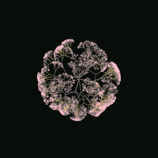

<p align="center">
    
</p>

# Gentrees NFT

Gentrees is a 1k procedurally generated collection of art trees!

It uses the ERC721 standard with lazy minting, and IPFS as data storage. Deployed on Polygon Mumbai.

## Getting started

To run the project, pull the repository and install its dependencies.

```bash
git clone https://github.com/javierpozzi/gentrees-nft.git
cd gentrees-nft
npm install
```

Rename file `.env.example` to `.env` on the root of the project.

Configure your NFT collection:

- `COLLECTION_SIZE`: The total size of the collection.
- `MINT_PRICE`: The price of minting one NFT. Represented in MATIC or ETH.
- `MAX_MINT_QUANTITY`: The maximum amount of NFTs that can be minted in one transaction.

Get your Alchemy key (or other provider Ethereum mainnet url) and paste it on `MUMBAI_URL` or `POLYGON_URL` variables, based on where you want to deploy the contract.

Get your Pinata key and secret to upload metadata and images to IPFS, and paste them at `.env`.

Get your Polygonscan key and paste it on `POLYGONSCAN_API_KEY` to verify your contract.

Set your address private key with `PRIVATE_KEY`.

## Scripts

The project includes a set of scripts to automate the generation and uploading of the collection.

### Generation collection

To generate the trees metadata:

```bash
npx hardhat run scripts/generator/generateTrees.ts
```

To generate the images:

```bash
npx hardhat run scripts/generator/generateImages.ts
```

To compress the generated images:

```bash
npx hardhat run scripts/generator/compressImages.ts
```

### Uploading collection

First, upload the images to IPFS:

```bash
npx hardhat upload-images
```

Then, update the metadata with the images CID from IPFS (from the previous command):

```bash
npx hardhat update-meta --imagescid YOUR_IMAGES_CID
```

After that, upload the metadata to IPFS:

```bash
npx hardhat upload-meta
```

Finally, deploy the contract with the metadata CID (from the previous command) and specifying the network (Polygon or Mumbai):

```bash
npx hardhat deploy --metadatacid YOUR_METADATA_CID --network mumbai
```

You can also mint directly from a script, specifying the network and how many NFTs you want to mint:

```bash
npx hardhat mint --contract YOUR_CONTRACT_ADDRESS --quantity 5 --network mumbai
```

Remember to verify your contract, specifying the network and the metadata CID:

```bash
npx hardhat verify YOUR_CONTRACT_ADDRESS "ipfs://YOUR_METADATA_CID/" --network mumbai
```

## Links

[OpenSea collection](https://testnets.opensea.io/collection/gentrees)

[Minting dApp](https://gentrees-nft.vercel.app/) (Based on [HashLips Minting dApp](https://github.com/HashLips/hashlips_nft_minting_dapp))

## See also

- [SmartDonations](https://github.com/javierpozzi/smart-donations): A Solidity smart contract that allows you to invest your donations to charities.
